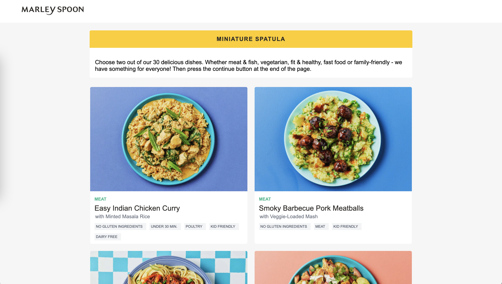

# Miniature Spatula

Code challenge of a small front-end application to display recipes from an API, using Next.js and React.



## Instructions for installing: 

Download the project from this github repository

Install the dependencies running:
```
npm install
```
Then run:

```
npm run dev
```

Open http://localhost:3000 in your browser
## Instructions for using the app:

To use the app, click on two recipe cards, then click in the button continue at the end of the page. In the next page fill in name and email to send the selected recipes, name and email to a post request. 

## Improvements:

If I would have more time to learn and implement what I'd learnt I would have:

- added a background color on the selected recipes
- allowed user to unselect recipes
- made the continue button unvailable if 2 recipes are not selected 
- added a checker for name and email being valid
- sended the data with post request
- add media queries for responsiveness under 900px
- created and run tests


